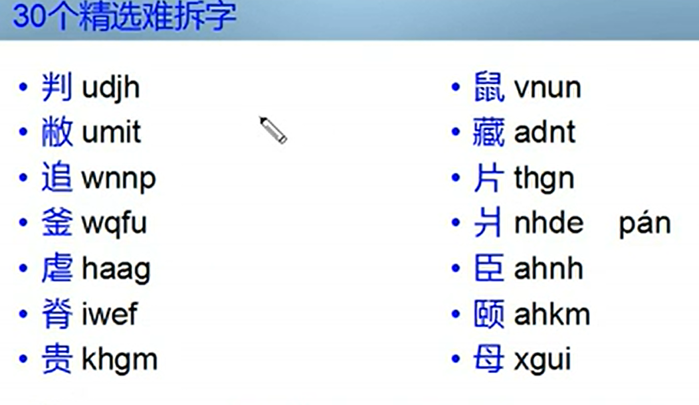
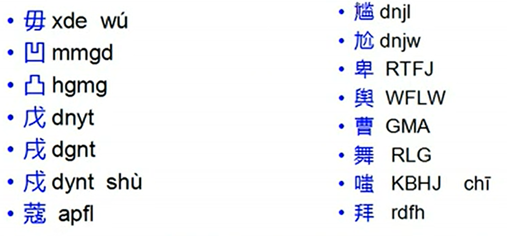
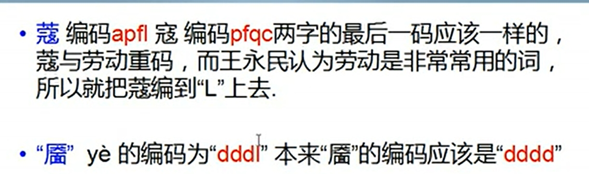

需下载上面的图片，否则显示不来图片
##  五个区为：

- 横:G F D S A	

- 竖:H J K L M

- 撇:T R E W Q

- 捺:Y U I O P

- 折:N B V C X


# 键名汉字

每个键的口诀中的第一个字  

-  只需要打一下该键 (在第二个位置就会出现)  
- 或者打四下该键


​		

# 一级简码

使用频率极高，打一次按空格就出来

- ```
   经发同和我以为，在人民中国这一主要工地上，有的是产不了  
  ```


​                                                                


# 单笔画

打两次该键+ll   


# 成字字根

本来就是一个汉字

```
特殊成字:与正常书写方式不同
力(ltn)要先打撇再打折
乃(etn)先撇在折
戈(agnt)先横在折在撇在捺
```


# <font color='red' >横区</font>

##     G


- 

## F

- 


## D

1. 

2. 

   

## S


## A


1. 
2. 


# <font color='red' >竖区</font>

##  H

- 
 ## J


- 

## K

- 
## L

- 
## M


- 


# <font color='red' >撇区：</font>

## T


## R


 **<font color='orange' >*注意区分Q键和E键*</font>**

## E


## W

1. 
 ## Q


# 捺区：

## Y


## U


##  I
 <font color='orange' >难点：水 的变形</font>


## O


## P


# <font color='red' >折区</font>：

## N

**<font color='orange' >一笔带钩的用乙(N)来代替</font>**


## B


## V


## C


## X


# <font color='red'>拆分原则</font>

  - ## 书写原则:

    - ​      <font color="blue">“先左后右, 先上后下 ,先横后竖, 先撇后捺, 先内后外, 先中间后两边, 先进门后关门”等。</font>

  - ## 取大优先

  - ## 兼顾直观:

  - ## 能散不连:

    -  <font color="blue">如果一个结构可以视为几个基本字根的散的关系，就不要认为是连的关系。</font>
    -  <font color="blue">例如“主”字按取大优先,应取“一、土” ,但根据此规则,只能取“丶 、王”</font>

  - ## 能连不交:

    - <font color="blue">当一个字可以视作相连的几个字根,也可视作相交的几个字根时,我们认为,相连的情况是可取的</font>

**<font color='red'>总之,拆分应兼顾几个方面的要求。一般说来,应当保证每次拆出最大的基本字根,在拆出字根的数目相同时,“散”比“连”优先, “连”比“交”先。</font>**


# **<font color='green'>非字根部首拆分</font>**


 **识别码：由于字根在组成汉字时,即使所使用的字根完全相同,如果排列的方式不同也会得到不同的汉字;**
<font color='red'>**因此，五笔字型提出了末笔交叉识别码,它是有助于区别字根组合相同而字根排列位置相异的不同汉字的一种补充编码。**</font>


# <font color='red' >难拆字</font>：



```

```





```ABAP
Z和L功能键
```


# 易错字：

```
朱：ri   刁：ngd  羌：udnb	失：rw	凸：hgmg 凹：mmgd 	物：tr	余：wtu	长：ta	求：fiy  年：rh
舛：qah	根：sve  末：gs 未：fii  丈：dyi 史：kq   乎：tuh  缶：rmk	久：qy  凿：ogu  寒：pfj   臣：ahn
离：yb  予：cbj 刀：vn 九：vt  贯：xfm  并：ua

```

